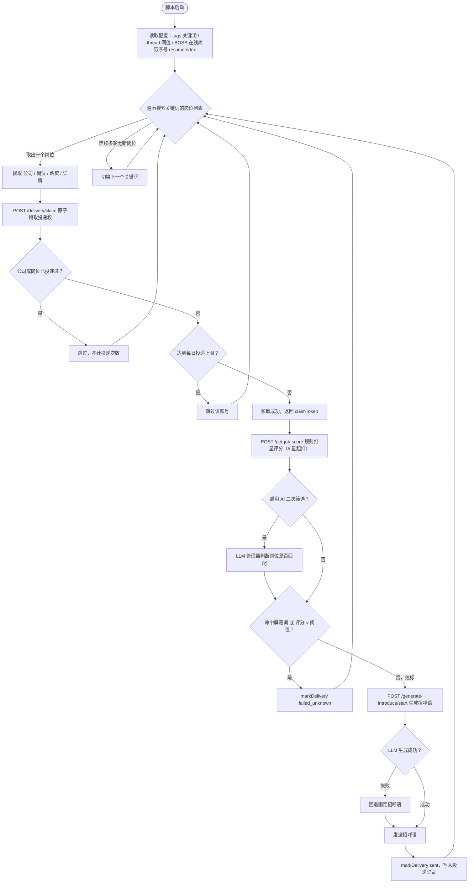
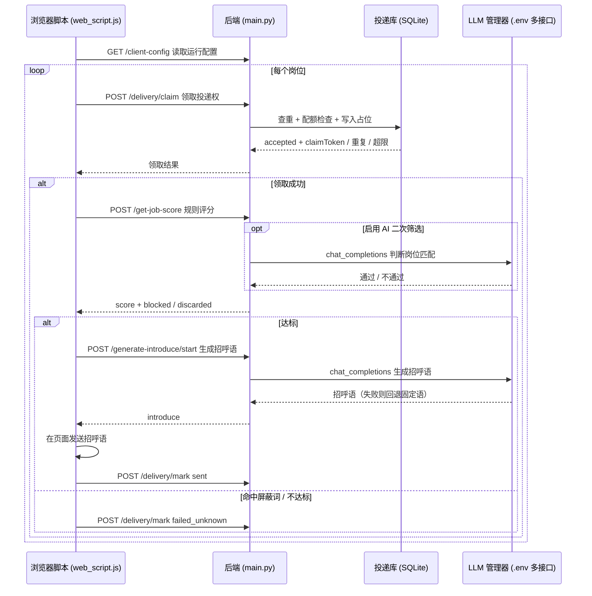

# goodjob

原项目：https://github.com/czc6666/czc-good-job


## 项目功能

- [x] 自动投简历

- [x] 多账号投简历

- [x] 统计面板

- [x] 配置面板

- [x] 固定打招呼

- [x] AI智能打招呼

- [x] 关键词筛选岗位

- [x] LLM接入管理器

- [x] 重复岗位跳过


------

**主链能力：**

- 在 Boss 直聘岗位列表里轮换搜索关键词
- 对岗位做规则打分
- 达到阈值后自动打招呼
- 收到 Boss 新消息后直接发送指定简历
- 连续多轮没有新岗位时自动切换关键词继续挂机
- 遇到超时、详情异常、打招呼异常时自动恢复

## 投递流程（UML）

### 活动流程图：单个岗位如何被处理



### 时序图：脚本、后端、投递库与 LLM 的交互



## 项目介绍

一个面向 Boss 直聘的轻量自动投递简历项目，采用“浏览器脚本 + 本地 Python 后端”的组合方式。


## 项目结构

- `main.py`：FastAPI 应用创建、生命周期和服务启动入口
- `routes/`：按“岗位投递”和“管理运行”归类的 HTTP 接口
- `app_state.py`：数据库、日志路径、进程锁和启动迁移等共享资源
- `job_scoring.py`：岗位文本解析与纯规则扣星评分
- `llm_tasks.py`：简历读取、定制招呼语和 AI 岗位筛选
- `llm_gateway.py`、`llm_manager.py`、`llm_env_store.py`：单接口请求、多接口调度和 `.env` 持久化
- `delivery_store.py`、`resume_store.py`、`admin_store.py`：投递、简历和管理配置存储
- `storage_io.py`：原子文本写入和 JSONL 读写
- `config.py`、`prompts.py`：运行配置、旧配置迁移和当前使用的 LLM 提示词
- `web_script.js`：Boss 页面 Tampermonkey 单文件脚本
- `dashboard/`、`dashboard_data.py`：统计管理面板及数据聚合
- `user_config.example.json`：可直接复制使用的当前格式配置模板
- `resumes/`：网页管理并提供给 LLM 使用的真实简历目录
- `resume-example.md`：简历模板，仅用于创建真实简历，不在网页管理页展示

**配置文件**

- `user_config.json`、`resumes/` 中的真实简历、日志文件等本地文件默认不进入仓库
- `user_config.example.json` 是公开模板，不建议直接提交真实配置
- `.env.example` 是公开的环境变量模板，真实 `.env` 只保存在本机

## 快速开始

### 1. 安装依赖

```bash
pip install -r requirements.txt
```

### 2. 配置外部 LLM（可选）

```bash
cp .env.example .env
```

推荐启动服务后，在网页面板的「系统管理 → 接口管理」中配置；也可以直接编辑 `.env`：

```env
GOODJOB_LLM_1_NAME=主接口
GOODJOB_LLM_1_API_BASE=https://your-provider.example/v1
GOODJOB_LLM_1_API_KEY=your-api-key
GOODJOB_LLM_1_MODEL=gpt-4.1-mini
GOODJOB_LLM_1_PROXY_URL=http://127.0.0.1:7890
GOODJOB_LLM_1_PROXY_ENABLED=true
GOODJOB_LLM_1_ENABLED=true
```

代理按接口独立配置，当前支持 `http://` 和 `https://`。关闭代理开关后，该接口强制直连，不读取系统代理环境变量。代理地址含用户名和密码时，网页只显示脱敏值。

### 3. 准备用户配置

```bash
cp user_config.example.json user_config.json
```

首次最少只需要改这些字段：
- `introduce`：固定打招呼语
- `tags`：搜索关键词列表
- `frontend.resumeIndex`：BOSS 页面发送在线简历时使用的序号，从 0 开始；与 LLM 读取的本地简历无关
- `frontend.thread`：投递阈值

### 4. （可选）准备简历文件

```bash
cp resume-example.md resumes/resume.md
```

说明：
- `resumes/` 只存放真实简历，网页简历管理页可在该目录中选择、新建和编辑 Markdown/TXT 文件
- 网页设置的当前简历会作为 LLM 生成定制招呼语和执行 AI 岗位筛选时的默认简历
- `resume-example.md` 是项目模板，不会出现在简历管理页，也不会作为 LLM 的简历输入

### 5. 启动后端

```bash
python main.py
```

启动后可打开投递统计面板：

```text
http://127.0.0.1:47999/dashboard
```

统计面板同时提供：
- 本机配置管理：编辑 `user_config.json` 常用参数与高级评分规则
- 简历管理：选择、新建和编辑 `resumes/` 中的 Markdown/TXT 简历，并设置 LLM 使用的当前简历
- 提示词管理：通过 `prompt_overrides.json` 安全覆盖固定提示词，不直接改 Python 源码
- 实时监控：展示脚本版本、在线实例、当前阶段、计数器和实时日志
- 高级统计：真实中国省级地图、行业 TOP 10，以及城市、经验、学历、薪资上下限和关键词筛选

### 6. 部署浏览器脚本

把 `web_script.js` 内容粘贴到 Tampermonkey 中，然后打开 Boss 直聘页面即可。

## 最小使用路径

1. 复制 `.env.example` 为 `.env`，按需配置外部 LLM
2. 复制 `user_config.example.json` 为 `user_config.json`
3. 复制 `resume-example.md` 为 `resumes/resume.md`
4. 修改：
   - `introduce`
   - `tags`
   - `frontend.resumeIndex`（BOSS 在线简历序号）
   - `frontend.thread`
5. 启动后端 `python main.py`
6. 浏览器装入 `web_script.js`
7. 打开 Boss 直聘页面测试
