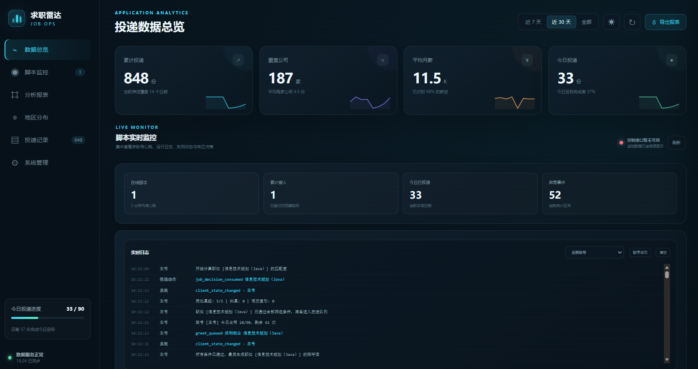

# boos-goodjob

原项目：https://github.com/czc6666/czc-good-job


## 项目功能

- [x] Boss 直聘岗位关键词轮换搜索，连续空轮后自动切换关键词
- [x] 规则扣星评分与可配置的岗位筛选规则
- [x] 自动投递简历与多账号/多浏览器实例运行
- [x] 原子领取投递资格、状态跟踪、失败释放与重复岗位跳过
- [x] 账号每日投递配额与运行计划控制
- [x] 收到 Boss 新消息后自动发送指定在线简历
- [x] 固定招呼语与基于简历和岗位的 AI 定制招呼语
- [x] 关键词筛选岗位与 AI 二次筛选
- [x] HR 活跃度筛选
- [x] 岗位顺序、详情等待、随机跳过与投递间隔的节奏随机化
- [x] 多大模型接口管理、故障转移/轮询调度、代理配置与接口测活
- [x] 运行安全策略：全局/单实例启动、暂停、结束、仅扫描、禁投递与异常自动暂停
- [x] 实时实例状态、心跳、事件流、操作日志、错误记录与审计信息
- [x] 统计管理面板与实时数据刷新
- [x] 投递趋势、转化漏斗、省市热力地图、薪资、岗位类型和行业分析
- [x] 投递记录搜索、状态/城市/经验/学历/薪资/关键词筛选、分页、导出与删除
- [x] 配置管理、简历新建/编辑/切换与提示词安全覆盖
- [x] 局域网免令牌、公网共享令牌、HTTPS 反向代理与可信代理校验
- [x] 节奏随机化系统
- [x] 多周期定时投简历系统（每天、工作日、每周与日期范围）

## TODO
- [ ] AI多简历系统
- [ ] 自动发送附件简历
- [ ] AI聊天系统


------

**主链能力：**

- 在 Boss 直聘岗位列表里轮换搜索关键词
- 对岗位做规则打分
- 达到阈值后自动打招呼
- 收到 Boss 新消息后直接发送指定简历
- 连续多轮没有新岗位时自动切换关键词继续挂机
- 遇到超时、详情异常、打招呼异常时自动恢复

### 统一投递流程（V2）

正常投递按以下顺序执行：

`启动预检 → 候选乱序 → 详情随机延迟 → 字段校验 → 公司+岗位查重 → 扣星/阈值 → HR 活跃 → 随机跳过 → qualification → claim → AI 岗位筛选 → 投递延迟 → AI/固定招呼语 → queued → 平台沟通 → sent`

对应的核心门禁接口顺序是 `/delivery/qualify → /delivery/claim → /job-filter/start`。

- `/delivery/qualify` 只执行字段、查重、规则、HR、策略和额度预检，不调用 AI。
- 正常模式必须先取得 `claimToken`，之后才能调用 AI 岗位筛选；仅扫描模式不 claim，且只有服务端同时开启“仅扫描”和“扫描 AI”才会调用 AI。
- `queued` 必须在 BOSS 平台动作之前成功落库。最终状态写入失败时只重放后端状态，不会重放平台动作。
- 旧版脚本/API 协议会 fail-closed。Dashboard 的“投递门禁策略”卡可编辑安全开关、时段、额度、连续失败和节奏间隔，并显示当前阶段。

- Boos每个账号每日投递上线: 150
- 推荐接入LLM,智能根据简历匹配岗位与打招呼,提高HR回复率


## 项目介绍

一个面向 Boss 直聘的轻量自动投递简历项目，采用“浏览器脚本 + 本地 Python 后端”的组合方式。



## 项目结构

- `main.py`：可执行入口，负责组装并启动 FastAPI 服务；直接运行时会在服务就绪后使用系统默认浏览器打开统计面板
- `app/`：后端业务代码包
  - `app/paths.py`：集中管理项目根目录与所有本地数据文件路径
  - `app/config.py`：运行配置、旧配置迁移与热加载
  - `app/state.py`：数据库、日志路径、进程锁和启动迁移等共享资源
  - `app/scoring.py`：岗位文本解析与纯规则扣星评分
  - `app/runtime.py`：浏览器工作器运行态、控制策略与事件流
  - `app/routes/`：按“岗位投递”和“管理运行”归类的 HTTP 接口
  - `app/llm/`：`gateway.py` 单接口请求、`manager.py` 多接口调度、`env_store.py` `.env` 持久化、`tasks.py` 招呼语与筛选、`prompts.py` 提示词
  - `app/storage/`：`io.py` 原子写入与 JSONL、`delivery_store.py`/`resume_store.py`/`admin_store.py` 投递、简历与管理配置存储、`dashboard_data.py` 面板数据聚合
- `dashboard/`：统计管理面板前端资源（HTML/CSS/JS 与地图数据）
- `scripts/`：地图等离线数据构建脚本
- `web_script.js`：Boss 页面 Tampermonkey 单文件脚本
- `user_config.example.json`：可直接复制使用的当前格式配置模板
- `resumes/`：网页管理并提供给 LLM 使用的真实简历目录
- `resume-example.md`：简历模板，仅用于创建真实简历，不在网页管理页展示

**配置文件**

- `user_config.json`、`resumes/` 中的真实简历、日志文件等本地文件默认不进入仓库
- `user_config.example.json` 是公开模板，不建议直接提交真实配置
- `.env.example` 是公开的环境变量模板，真实 `.env` 只保存在本机

## 快速开始

### 0.使用说明
后端控制面板->网页脚本（可多个）

### 1. 安装依赖

```bash
pip install -r requirements.txt
```

### 2. 配置外部 LLM（建议）

```bash
cp .env.example .env
```

推荐启动服务后，在网页面板的「系统管理 → 接口管理」中配置；也可以直接编辑 `.env`：

```env
GOODJOB_LLM_1_NAME=主接口
GOODJOB_LLM_1_API_BASE=https://your-provider.example/v1
GOODJOB_LLM_1_API_KEY=your-api-key
GOODJOB_LLM_1_MODEL=gpt-4.1-mini
GOODJOB_LLM_1_PROXY_URL=http://127.0.0.1:7890
GOODJOB_LLM_1_PROXY_ENABLED=true
GOODJOB_LLM_1_ENABLED=true
```

代理按接口独立配置，当前支持 `http://` 和 `https://`。关闭代理开关后，该接口强制直连，不读取系统代理环境变量。代理地址含用户名和密码时，网页只显示脱敏值。

### 3. 准备用户配置

```bash
cp user_config.example.json user_config.json
```

首次最少只需要改这些字段：
- `introduce`：固定打招呼语
- `tags`：搜索关键词列表
- `frontend.resumeIndex`：BOSS 页面发送在线简历时使用的序号，从 0 开始；与 LLM 读取的本地简历无关
- `frontend.thread`：投递阈值

### 4. （可选）准备简历文件

```bash
cp resume-example.md resumes/resume.md
```

说明：
- `resumes/` 存放简历
- 网页设置的当前简历会作为 LLM 生成定制招呼语和执行 AI 岗位筛选时的默认简历
- `resume-example.md` 简历模板

### 5. 启动后端

```bash
python main.py
```

直接运行 `python main.py` 后，程序会等待服务就绪，并使用系统默认浏览器自动打开投递统计面板。若未自动打开，可手动访问：

```text
http://127.0.0.1:47999/dashboard
```

统计面板同时提供：
- 配置管理：编辑 `user_config.json` 常用参数与高级评分规则
- 简历管理：选择、新建和编辑 `resumes/` 中的 Markdown/TXT 简历，并设置 LLM 使用的当前简历
- 提示词管理：通过 `prompt_overrides.json` 安全覆盖固定提示词，不直接改 Python 源码
- 实时控制：按全部实例或单个浏览器执行开启、暂停和结束，并展示连接、执行、同步状态
- 实时监控：展示脚本版本、在线实例、当前阶段、计数器和集中实时日志
- 高级统计：真实中国省级地图、行业 TOP 10，以及城市、经验、学历、薪资上下限和关键词筛选

### 前端面板设置说明

以下参数可在 Dashboard 的“系统管理”中配置。表中的默认值来自公开配置模板；保存普通参数后后端会热加载，浏览器脚本会在下一次配置同步后使用新值。`backend.delivery_db_path` 修改后需要重启后端。

#### 基础资料

| 面板字段 | 配置键 | 默认值/范围 | 作用 |
| --- | --- | --- | --- |
| 使用 LLM 生成打招呼语 | `llm_greeting_enabled` | `true` | 岗位通过筛选后，根据当前简历和岗位信息生成定制招呼语；关闭后直接使用固定招呼语。 |
| 固定打招呼语 | `introduce` | 文本 | LLM 关闭、没有可用接口、没有简历或生成失败时的兜底内容。 |
| 回复风格 | `character` | 文本 | 当前版本只保存并下发该字段，运行中的招呼语生成和 AI 筛选尚未使用它；修改不会改变实际结果。 |
| 搜索关键词 | `tags` | 1–80 项，每项不超过 80 字 | BOSS 搜索关键词列表。脚本按顺序轮换，连续空轮后切换到下一个关键词；关键词不能重复。 |
| 当前简历 | `resume_name` | `resume.md` | `resumes/` 中供 LLM 招呼语生成和 AI 二次筛选读取的简历，与 BOSS 在线简历序号无关。 |

#### 后端参数

| 面板字段 | 配置键 | 默认值/范围 | 作用 |
| --- | --- | --- | --- |
| 每日投递上限 | `backend.daily_greet_limit` | `90`；1–150 | 每个账号标识每天最多占用的投递额度。多个浏览器使用同一账号标识时共享额度，达到上限后自动暂停。 |
| 投递数据库文件 | `backend.delivery_db_path` | `delivery_state.db`，只能是文件名 | 保存投递去重、额度、投递令牌和 LLM 用量。改名后必须重启后端，旧数据库不会自动合并到新文件。 |

#### 浏览器脚本参数

| 面板字段 | 配置键 | 默认值/范围 | 作用 |
| --- | --- | --- | --- |
| BOSS 发送简历序号 | `frontend.resumeIndex` | `0`；0–50 | 收到新消息后发送 BOSS 在线简历列表中的第几份，从 0 开始；不影响本地简历。 |
| 匹配阈值 | `frontend.thread` | `50`；0–100 | 规则评分达到该分数才继续投递。规则评分按 5 星换算为 100、80、60、40、20、0 分。 |
| 页面通信有效期 | `frontend.timestampTimeout` | `3000 ms`；0–600000 | 搜索页、详情页和聊天页时间戳的有效期。过小会误判慢页面失效，过大会误认旧标签页。 |
| 仅自动打招呼 | `frontend.onlyGreet` | `false` | 开启后只处理搜索岗位，不进入聊天列表代回复或发送简历。 |
| 轮次重启等待 | `frontend.roundRestartDelayMs` | `2000 ms`；0–600000 | 当前轮次完成后，启动下一轮前的等待时间。 |
| 最大连续空轮 | `frontend.maxEmptyRounds` | `3`；0–10000 | 连续没有新岗位的轮数达到该值后切换关键词。设为 0 会在轮次结束时立即切换。 |
| 职位详情超时 | `frontend.detailTimeout` | `10000 ms`；0–600000 | 打开详情页后等待岗位信息回传的最长时间，超时则跳过岗位。 |
| 打招呼超时 | `frontend.greetTimeout` | `12000 ms`；0–600000 | 发送打招呼后等待聊天页回执的最长时间，超时会标记未知失败并继续。 |

#### 岗位预加载

| 面板字段 | 配置键 | 默认值/范围 | 作用 |
| --- | --- | --- | --- |
| 预加载滚动距离 | `frontend.preloadScrollPixels` | `180 px`；0–5000 | 预加载岗位列表时每轮向下滚动的距离。 |
| 预加载滚动等待 | `frontend.preloadScrollWaitMs` | `450 ms`；0–600000 | 每次滚动后等待懒加载完成的时间。网络较慢时应增大。 |
| 预加载稳定轮数 | `frontend.preloadStableRoundsLimit` | `3`；1–10000 | 岗位数量和滚动位置连续不增长多少轮后结束预加载。不能大于最大轮数。 |
| 预加载最大轮数 | `frontend.preloadMaxRounds` | `300`；1–10000 | 单次预加载最多滚动多少轮的硬上限。 |
| 每隔几轮激活岗位卡 | `frontend.preloadActivateCardEvery` | `0`；0–10000 | 每隔多少轮轻点一次岗位卡以刺激页面继续加载；0 表示关闭。 |
| 激活岗位卡等待 | `frontend.preloadActivateCardWaitMs` | `250 ms`；0–600000 | 轻点岗位卡后额外等待的时间，仅在上项非 0 时生效。 |

#### 节奏随机化

`frontend.antiDetectionEnabled` 是总开关。关闭后，下面所有随机化参数全部失效，脚本恢复确定性行为。

| 面板字段 | 配置键 | 默认值/范围 | 作用 |
| --- | --- | --- | --- |
| 启用节奏随机化 | `frontend.antiDetectionEnabled` | `false` | 启用岗位乱序、随机跳过和可中断随机等待。 |
| 打乱岗位投递顺序 | `frontend.shuffleJobOrder` | `true`/`false` | 将本页新增岗位随机排序，避免固定从上到下投递。 |
| 随机跳过达标岗位 | `frontend.randomSkipRatio` | `0%`；0–100 | 岗位已通过其他筛选后，仍按该概率主动跳过；会降低实际投递量。 |
| 投递随机延时下限 | `frontend.randomDelayMinMs` | `0 ms`；0–600000 | 投递前后随机等待的最短时间。 |
| 投递随机延时上限 | `frontend.randomDelayMaxMs` | `0 ms`；0–600000 | 投递前后随机等待的最长时间，必须不小于下限。 |
| 职位详情随机延时下限 | `frontend.detailRandomDelayMinMs` | `0 ms`；0–600000 | 获取职位详情前随机等待的最短时间，覆盖搜索页和聊天页的详情入口；受 `antiDetectionEnabled` 总开关约束。 |
| 职位详情随机延时上限 | `frontend.detailRandomDelayMaxMs` | `0 ms`；0–600000 | 获取职位详情前随机等待的最长时间，必须不小于下限；受 `antiDetectionEnabled` 总开关约束。 |

#### HR 活跃筛选

| 面板字段 | 配置键 | 默认值/范围 | 作用 |
| --- | --- | --- | --- |
| 启用 HR 活跃筛选 | `frontend.hrActiveFilterEnabled` | `false` | 开启后，岗位必须命中所选 HR 活跃状态之一。 |
| HR 活跃状态 | `frontend.hrActiveLevels` | 至少选择 1 项 | 多选白名单：`online` 当前在线、`just_now` 刚刚活跃、`today` 今日活跃、`within_3_days` 3 日内、`this_week` 本周、`within_2_weeks` 2 周内、`this_month` 本月、`within_2_months` 2 月内、`within_3_months` 3 月内、`within_4_months` 4 月内、`within_5_months` 5 月内、`within_half_year` 近半年、`half_year_ago` 半年前、`unknown` 未知。无法识别的文案归入 `unknown`，只有选中 `unknown` 才放行。 |

#### 岗位扣星规则

- 每个岗位从 5 星开始；每颗星折算 20 分，再与 `frontend.thread`（0–100）比较。
- `scoring.title_deduction_keywords` 只匹配职位名称，`scoring.detail_deduction_keywords` 只匹配职位描述；每个关键词扣 1–5 星。
- 同一岗位命中多个关键词会累计扣星；有重叠时优先匹配更长、更具体的关键词。
- 扣星后的星数小于 0 时直接丢弃岗位；恰好为 0 时仍由匹配阈值决定。
- 关闭“启用岗位扣星规则”后，所有岗位保持 5 星/100 分，不会因扣星词被过滤，但 HR 筛选、AI 筛选和匹配阈值仍可能影响结果。

#### LLM 接口管理

接口配置保存在本机 `.env`，API Key 和代理凭据在网页中只显示脱敏值；最多支持 20 个接口。

| 面板字段 | 作用 |
| --- | --- |
| 调度策略：故障转移 | 按接口列表顺序调用；当前接口失败或熔断后切换到下一个，适合主接口加备用接口。 |
| 调度策略：轮询分摊 | 在可用接口之间轮流开始请求，用于分摊负载；单次失败仍会继续尝试其他接口。 |
| 请求超时 | 所有接口共用的单次请求超时，1–600 秒，默认 180 秒。 |
| AI 二次筛选 | 在规则评分后，再用当前简历和岗位信息让 LLM 判断是否适合；判断不通过时岗位分数置 0。它与 LLM 招呼语开关独立。 |
| 接口名称 | 仅用于面板、日志和用量统计，最多 60 字。 |
| 模型名称 | 发给 OpenAI 兼容接口的 `model` 值，必须是服务商实际模型 ID。 |
| API Key | 接口鉴权密钥；留空并保存表示保留原值。 |
| 接口地址 | OpenAI 兼容 API 基址，必须是 HTTP(S) 地址。 |
| 启用/停用接口 | 停用后不参与 LLM 请求，但配置保留。启用接口必须填完整地址、模型和 API Key。 |
| 使用代理 / 代理地址 | 对该接口单独启用 HTTP(S) 代理；关闭时强制直连，不读取系统代理。 |
| 接口顺序 | 决定故障转移优先级，也决定轮询的基础顺序。 |
| 测试/全部测活 | 用当前配置发送最小请求，检查地址、模型、密钥和代理是否可用；测试可能产生少量 Token。 |

#### 油猴状态窗连接设置

- **账号标识**：同一个 BOSS 账号在多个浏览器运行时填写相同值，用于共享每日额度、投递去重和监控归属；不能为空，最多 120 个字符。
- **后端地址**：填写 `http(s)://主机或域名:端口`，只允许 origin，不能包含路径、查询参数或账号密码。
- **共享令牌**：局域网连接通常可留空；公网访问时必须填写与后端 `.env` 中 `GOODJOB_SHARED_TOKEN` 一致的 32–256 字符令牌。

修改油猴连接设置后脚本会重新连接后端。自动化运行中应先暂停或结束，再修改连接设置，以免中断当前动作。

### 6. 部署浏览器脚本

把 `web_script.js` 内容粘贴到 Tampermonkey 中，然后打开 Boss 直聘页面。脚本会在左下角显示图片状态窗，可展开/收起本地日志和脚本设置；“开始/暂停/结束”操作由 Dashboard 提供。

状态窗默认不展开设置。点击状态窗操作区的“设置”按钮可打开或收起设置面板，可填写：

- `账号标识`：同一 Boss 账号在多个浏览器运行时填写相同标识
- `后端地址`：填写 `http(s)://IP或域名:端口`；局域网可不填令牌，公网连接填写共享令牌

设置保存后脚本会重新连接后端。自动化运行中为避免打断当前动作，需先暂停或结束后再修改连接设置。

首次接入实例默认是“已结束”，不会自动投递。打开后端 Dashboard，在“脚本实时监控”中点击全局或实例的“开启”后才会运行；“结束”只销毁当前自动化执行链，控制心跳仍然保留，因此可以再次从网页开启。

### 7. 远程访问安全

后端对环回、RFC1918、IPv6 ULA 和链路本地地址免令牌。公网访问必须在 `.env` 配置 32–256 位共享令牌：

```env
GOODJOB_SHARED_TOKEN=replace-with-a-random-token-at-least-32-characters
```

公网入口必须使用 HTTPS 反向代理。只有自有代理地址可以加入 `GOODJOB_TRUSTED_PROXIES`，禁止使用 `*`：

```env
GOODJOB_TRUSTED_PROXIES=127.0.0.1/32
```

可信代理必须在每个请求中覆盖 `X-Forwarded-For` 和 `X-Forwarded-Proto`；任一头缺失、重复或非法时后端都会拒绝请求。未加入可信列表的本机或局域网 peer 不得携带这两个转发头，以免错误获得局域网免令牌权限。

Dashboard 的令牌只保存在当前标签页 `sessionStorage`；油猴令牌只保存在 Tampermonkey GM storage，不会写入 `user_config.json`、URL 或日志。

## 最小使用路径

1. 复制 `.env.example` 为 `.env`，按需配置外部 LLM
2. 复制 `user_config.example.json` 为 `user_config.json`
3. 复制 `resume-example.md` 为 `resumes/resume.md`
4. 修改：
   - `introduce`
   - `tags`
   - `frontend.resumeIndex`（BOSS 在线简历序号）
   - `frontend.thread`
5. 启动后端 `python main.py`（服务就绪后会自动打开统计面板）
6. 浏览器装入 `web_script.js`
7. 打开 Boss 直聘页面，点击左下角状态窗的“设置”按钮，配置账号标识和后端地址
8. 在 Dashboard 的“脚本实时监控”中点击“开启”
